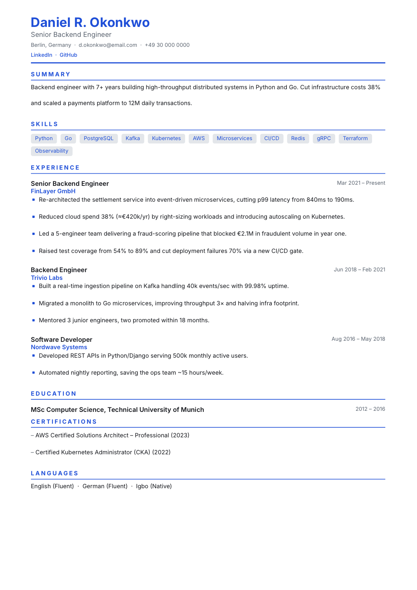
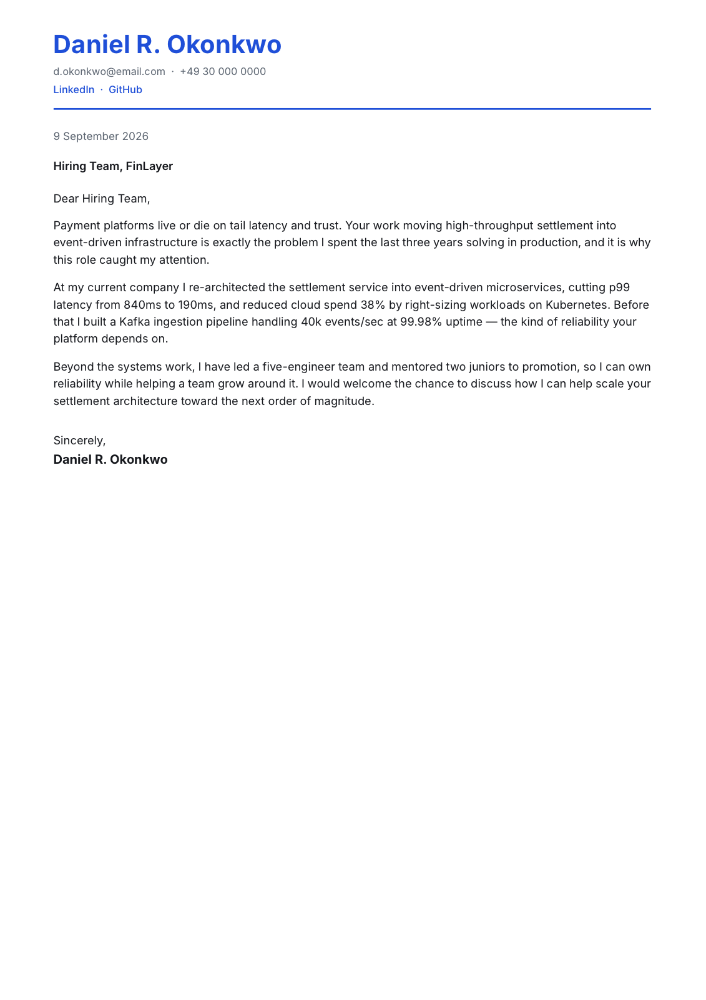

<div align="center">

# Resumee

**An AI engine that turns your profile + a job posting into an ATS-optimized, recruiter-ready résumé and cover letter — tailored to that specific job.**

Fill your professional profile once. Paste a vacancy. Get a market-, language- and seniority-aware résumé (in **two versions — with and without photo**) plus a tailored cover letter, exported to clean, ATS-parseable PDF.


</div>

---

<div align="center">

| Résumé (tailored, ATS-safe) | Cover letter (hooked to the company) |
|---|---|
|  |  |

<sub>Sample output rendered by the app on placeholder data — not a real person.</sub>

</div>

## Why it's different

Most résumé tools are templates you fill in. Resumee is an **engine with an opinion about what a good résumé is** — distilled from Indeed, StandOut CV, Oxford Careers, Prospects and MyPerfectResume into an editable [knowledge base](src/lib/prompts/knowledge/ideal-resume.md) that grounds every generation. It judges, tailors, and writes to that standard, then renders it in a layout built to survive both an ATS parser and a seven-second human skim.

> **Facts only.** The engine rewrites and re-prioritizes *your real profile* for each job — it never invents experience, employers, dates or metrics. Missing requirements land honestly in **Gaps**, and identity/contact details are copied verbatim from your profile, never re-typed by the model.

## How it works

1. **Profile once** — fill your Candidate Profile; an AI pass builds a reusable *Candidate Intelligence Profile*.
2. **Analyze a job** — paste the vacancy and get its market, language, seniority and ATS keywords, plus a full **scoring report**: an overall match %, a verdict (Strong / Good-with-tailoring / Weak), a **résumé-quality score** across six weighted dimensions, a **requirement-by-requirement breakdown** (met / partial / missing + severity), and concrete rewrite suggestions.
3. **Generate** — a résumé in **two versions** (a maximally ATS-safe no-photo layout + a with-photo layout, same strong content) and a tailored cover letter, one page each.
4. **Export** — clean PDF (A4 / US Letter). Everything is versioned in **History**.

## Features

- **Editable knowledge base** — the definition of a "good résumé" (structure, achievement-vs-duty, quantification, tailoring, ATS rules, scoring rubrics) lives in one Markdown file; tune the engine without touching code.
- **Gold-standard few-shot** — reference résumés steer density, metric-loading, bullet length and tone.
- **Two résumé versions per job** — no-photo (ATS-safe) + with-photo, from a single generation; regenerating refreshes both.
- **Reference-grade, ATS-safe PDF** — skill chips, accent section headers, a distinct links block, single linear column, real selectable text (ligatures disabled on the serif theme so keywords like "Swift" never lose a letter to font ligatures).
- **Cover letters that engage the company** — opens with a hook tied to the employer's mission, mirrors the vacancy, discloses relocation/visa-sponsorship needs honestly, and closes with a real call to action.
- **Full scoring** — résumé-quality + vacancy-match rubrics surfaced in the UI.
- **Provider-agnostic AI** — OpenRouter, TokenRouter, Anthropic, Moonshot (bring your own key; models auto-loaded).
- **Self-hostable & multi-user** — email + password accounts, DB sessions, **encrypted API keys** at rest, per-user rate limiting.

## Quick start

Requires **Node 18+**.

```bash
git clone https://github.com/hamidkazimov777-cmd/resumme.git
cd resumme
npm install
cp .env.example .env
# set APP_ENCRYPTION_KEY (and AUTH_SECRET) — generate each with:
node -e "console.log(require('crypto').randomBytes(32).toString('base64'))"
npm run db:push        # creates the local SQLite database
npm run dev            # http://localhost:3000
```

Then in the app:

1. **Register** an account (email + password).
2. **Settings** → paste a provider API key → **Load models** → pick one → **Set active**.
3. **Candidate Profile** → fill in → **Save** → run **Intelligence**.
4. **Job Analyzer** → paste a vacancy → **Generate** → open / download the PDFs.

## Tuning the engine

- **What "good" means** lives in [`src/lib/prompts/knowledge/ideal-resume.md`](src/lib/prompts/knowledge/ideal-resume.md) — edit it to change how the AI judges and writes.
- **Gold-standard examples** are in [`src/lib/prompts/knowledge/examples.ts`](src/lib/prompts/knowledge/examples.ts).
- **Regression evals** guard scoring quality. Add cases to `evals/fixtures/`, then:
  ```bash
  EVAL_PROVIDER=anthropic EVAL_MODEL=claude-sonnet-5 EVAL_API_KEY=sk-... npm run eval
  ```

## Tech stack

Next.js 16 (App Router) · TypeScript · Tailwind v4 · Prisma 6 + SQLite · `@react-pdf/renderer`.

## Project layout

```
src/lib/prompts/knowledge/   editable knowledge base + gold-standard few-shot
src/lib/prompts/             master prompt system + per-task builders
src/lib/ai/                  provider abstraction (OpenAI-compatible + Anthropic)
src/lib/pdf/                 ATS-friendly PDF documents (résumé + cover letter)
src/lib/design/              visual templates (theme = color/font/spacing over one linear doc)
src/server/                  profile + AI orchestration + data-integrity guards
src/app/api/                 route handlers   ·   src/app/  pages   ·   src/components/  UI
evals/  ·  scripts/eval.ts   scoring regression harness
```

## Notes

- **Self-hostable.** Runs locally on SQLite; Postgres-ready — set `datasource.provider = "postgresql"` in `prisma/schema.prisma` and point `DATABASE_URL` at your database. No payments/billing yet.
- **Your data stays local.** Profiles, generations and (encrypted) API keys live in `prisma/dev.db`; the DB, uploads and `.env` are git-ignored.
- **Known edge case.** `@react-pdf/renderer` can, on rare specific strings, mis-map a PDF's text layer (glyphs render correctly but text extraction garbles). Real profiles tested clean; tracked as an upstream follow-up.

## License

MIT
